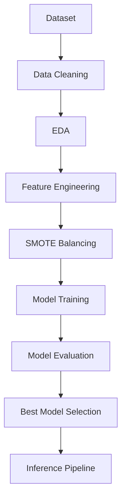

# 🧠 End-to-End Autism Spectrum Disorder Prediction using Machine Learning


## 📌 Overview

Built an end-to-end Machine Learning pipeline to predict Autism Spectrum Disorder (ASD) using AQ-10 screening questionnaire data.

### Key Highlights
- Performed Exploratory Data Analysis (EDA)
- Handled class imbalance using SMOTE
- Trained and compared Logistic Regression, Random Forest, and XGBoost models
- Evaluated models using Accuracy, ROC-AUC, and Stratified 5-Fold Cross-Validation
- Automated model persistence and inference pipeline
- Generated visual analytics for model interpretation

## 🛠 Tech Stack

Python • Pandas • NumPy • Scikit-Learn • XGBoost • Matplotlib • Seaborn • Joblib

## 🎯 Why This Project?

Autism diagnosis often requires extensive clinical assessment and specialist evaluation.

This project explores how machine learning can support preliminary ASD screening using AQ-10 behavioural questionnaire data, enabling faster and more scalable risk assessment.

## 🔄 ML Workflow



## 📁 Project Structure

```
autism_prediction/
├── data/
│   └── train.csv           ← Dataset (800 samples, AQ-10 questionnaire)
├── models/                 ← Saved model + scaler files (auto-created)
├── outputs/                ← Charts and plots (auto-created)
├── src/
│   ├── train.py            ← Full ML pipeline (EDA → train → evaluate → save)
│   └── predict.py          ← Run inference on a new patient record
├── requirements.txt
├── LICENSE
└── README.md
```

---

## ⚙️ Setup & Execution (VS Code — Windows)

### Step 1 — Open the project in VS Code
1. Place the `autism_prediction` folder somewhere convenient (e.g. `C:\Projects\`)
2. Open VS Code → **File → Open Folder** → select `autism_prediction`

---

### Step 2 — Create a virtual environment (Python 3.11 recommended)

Open the **VS Code Terminal** (`Ctrl + `` ` ```) and run:

```bash
# Create venv with Python 3.11
py -3.11 -m venv venv

# Activate it
venv\Scripts\activate
```

> ✅ You should see `(venv)` at the start of the terminal prompt.

---

### Step 3 — Install dependencies

```bash
pip install -r requirements.txt
```

This installs pandas, scikit-learn, XGBoost, imbalanced-learn, matplotlib, seaborn, and joblib.

---

### Step 4 — Train the model

```bash
python src/train.py
```

**What this does:**
- Loads and cleans `data/train.csv`
- Handles class imbalance with SMOTE
- Trains 3 models: Logistic Regression, Random Forest, XGBoost
- Prints accuracy, AUC-ROC, and cross-validation scores
- Saves model files to `models/`
- Saves 5 charts to `outputs/`

**Expected output:**
```
============================================================
   AUTISM PREDICTION — ML PIPELINE
============================================================
[1] Dataset loaded  →  800 rows × 22 cols
[2] Preprocessing …
[3] Train/Test split  →  Train: 640 | Test: 160
[4] Training models …
    Logistic Regression       Acc=...  AUC=...  CV-AUC=...
    Random Forest             Acc=...  AUC=...  CV-AUC=...
    XGBoost                   Acc=...  AUC=...  CV-AUC=...
[5] Best Model → ...
[6] Saving visualisations …
```

---

### Step 5 — View outputs

Open the `outputs/` folder to find:

| File | Description |
|------|-------------|
| `confusion_matrices.png` | Side-by-side confusion matrices for all 3 models |
| `roc_curves.png` | ROC curves with AUC scores |
| `model_comparison.png` | Bar chart comparing Accuracy vs AUC |
| `feature_importance.png` | Top 15 predictive features (Random Forest) |
| `aq_score_distribution.png` | AQ-10 score distribution by ASD class |


### Step 6 — Run inference on a new patient

Edit the `sample` dictionary in `src/predict.py` with a patient's values, then run:

```bash
python src/predict.py
```

**Output example:**
```
=============================================
   AUTISM PREDICTION — INFERENCE
=============================================
  Model used : XGBoost
  Prediction : ⚠  ASD Detected
  Probability: 87.43%
=============================================
```

---

## 📊 Results

| Model | Accuracy | ROC-AUC | CV-AUC (5-fold) |
|-------|----------|---------|------------------|
| Logistic Regression | 79.4% | 0.836 | 0.9162 ± 0.0334 |
| Random Forest | 83.1% | 0.873 | 0.9703 ± 0.0133 |
| XGBoost | 83.1% | 0.874 | 0.9513 ± 0.0169 |

🏆 **Best Model (by ROC-AUC): XGBoost**

### Key Findings

- XGBoost achieved the highest ROC-AUC score (0.874) and tied with Random Forest for the highest accuracy (83.1%).
- Random Forest delivered nearly identical performance, with a ROC-AUC of 0.873 and the same accuracy.
- Logistic Regression provided a strong, interpretable baseline at 79.4% accuracy and 0.836 ROC-AUC.
- AQ-10 questionnaire scores showed strong predictive power for ASD classification, and the AQ-10 total score (`result`) emerged as the most influential feature in the Random Forest model.
- **On the ASD (positive) class specifically, recall actually declines as model complexity increases**: Logistic Regression recovers 68.8% of true ASD cases, Random Forest 65.6%, and XGBoost 59.4%. Factoring in precision as well, Random Forest edges out XGBoost on ASD-class F1 (≈60.9% vs ≈58.4%). For a screening context — where missing a true ASD case is typically costlier than a false alarm — this trade-off is worth weighing alongside the headline accuracy/AUC numbers rather than picking a "best model" on aggregate metrics alone.

---

## 📊 Visualizations

Charts generated by `train.py` and saved to the `outputs/` folder, shown here for quick reference.

### AQ-10 Score Distribution by Class


### Confusion Matrices


### ROC Curves


### Feature Importance (Random Forest)


### Model Comparison — Accuracy vs AUC-ROC


## 🔬 Dataset Features

| Feature | Description |
|---------|--------------|
| A1–A10 Score | AQ-10 behavioural screening questions (0 or 1) |
| age | Patient age |
| gender | Male / Female |
| ethnicity | Ethnic background |
| jaundice | Jaundice at birth (yes/no) |
| austim* | Family member with autism (yes/no) |
| contry_of_res* | Country of residence |
| used_app_before | Prior screening app usage |
| result | Raw AQ-10 score |
| relation | Who completed the questionnaire |
| **Class/ASD** | **Target: 1 = ASD, 0 = No ASD** |

\* `austim` and `contry_of_res` are spelled exactly as they appear in the original source dataset's columns — kept as-is for compatibility with the raw data rather than corrected.

**Source:** The questionnaire data is based on the AQ-10 screening instrument (Baron-Cohen et al.). The `train.csv` used here is sourced from the **ML Olympiad — Autism Prediction Challenge** on Kaggle:
🔗 [https://www.kaggle.com/competitions/autism-prediction](https://www.kaggle.com/competitions/autism-prediction)

---

## 🤖 Models Used

| Model | Notes |
|-------|-------|
| Logistic Regression | Baseline linear model, uses StandardScaler |
| Random Forest | Ensemble of 200 decision trees |
| XGBoost | Gradient boosting, typically best performer |

**Imbalance handling:** SMOTE (Synthetic Minority Oversampling Technique)
**Evaluation:** Accuracy, AUC-ROC, Stratified 5-Fold Cross-Validation

---

## ⚠️ Disclaimer
This project is for academic/educational purposes only. It is **not** a clinical diagnostic tool. Always consult a qualified medical professional for autism diagnosis.

---

## 📄 License
This project is licensed under the MIT License — see [LICENSE](LICENSE) for details.

## 👤 Author
**Shivarchan Coomaran**
GitHub: [github.com/shiv-speccc](https://github.com/shiv-speccc) • LinkedIn: [linkedin.com/in/shivarchan-coomaran-b47b14293](https://www.linkedin.com/in/shivarchan-coomaran-b47b14293)
